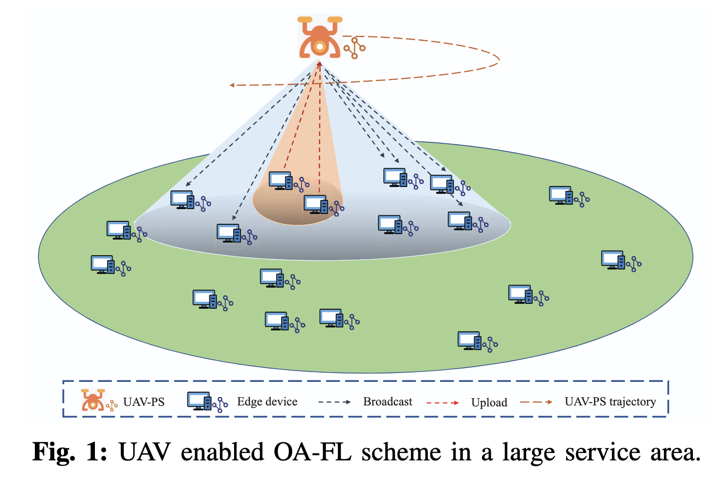

# UAV Enabled Over-the-Air Federated Learning

This repository contains the official code for the paper "UAV Enabled Over-the-Air Federated Learning: A Hierarchical Aggregation Approach" (to appear in IEEE Transactions on Wireless Communications).

## Authors
Xiangyu Zhong (The Chinese University of Hong Kong), Chenxi Zhong (University of Electronic Science and Technology of China), Xiaojun Yuan (University of Electronic Science and Technology of China), and Ying-Jun Angela Zhang (The Chinese University of Hong Kong)

## TL;DR
The first attempt to introduce UAV as a parameter server to coordinate over-the-air federated learning in relatively large service area with joint communication-learning design.

## Abstarct

With explosive increase of data at the mobile edge, federated learning (FL) emerges as a promising technique to reduce data transmission costs and privacy leakage risks. Nevertheless, the huge communication overhead for an increasing volume of edge devices still restricts the FL performance. Over-the-air computation (AirComp) is viable for alleviating the communication burden in FL systems. However, there consequently appears a straggler issue restraining the performance of the over-the-air FL (OA-FL) framework, which is even worse especially when devices training a machine learning model are distributed over a relatively large service area.
In this paper, we propose an unmanned aerial vehicle (UAV) enabled OA-FL scheme, where the UAV acts as a parameter server (PS) to aggregate the local gradients hierarchically for global model updating. 
The global aggregation frequency is tunable in the hierarchical aggregation approach, enabling it to balance the resource consumption between communication and learning.
Building on this approach, we carry out a gradient-correlation-aware FL performance analysis
and jointly optimize the trajectory of UAV-PS, the device selection state, and the aggregation coefficients.
An algorithm based on alternating optimization (AO) is developed to solve the formulated problem, where successive convex approximation (SCA) and fractional programming (FP) are utilized for the convexification of the non-convex problem. 
Numerical simulation results demonstrate the effectiveness of our UAV enabled hierarchical aggregation scheme compared with several existing baselines.



## Key Files

This repository is organized as follows:

- `MonteCarlo.py`: Main entry point. This script orchestrates the overall workflow, including data loading, model training, hierarchical aggregation, and result output.
- `optlib/opt.py`: Contains optimization algorithms. The core function is `XYZ_J`, which implements the proposed optimization algorithm.
- `datasets/dataset_base.py`: Handles dataset loading and preprocessing.
- `modules/`: Includes channel modeling, environment parameters, network structures, and other functional modules.
- `browser/`, `input/`, `output/`: Supporting folders for visualization, input data (e.g., device locations), and output results (accuracy, loss, etc.).

**Install Required Python Packages**

   The following packages are essential for running the code:
   - torch (PyTorch)
   - cvxpy
   - mosek (for advanced convex optimization)

## Citation

If you find our work interesting, please consider citing:

Transaction Bibtex:
```bibtex
TBD
```

Earlier Conference Version:
```bibtex
@inproceedings{zhong2022uav,
  title={UAV-assisted hierarchical aggregation for over-the-air federated learning},
  author={Zhong, Xiangyu and Yuan, Xiaojun and Yang, Huiyuan and Zhong, Chenxi},
  booktitle={GLOBECOM 2022-2022 IEEE Global Communications Conference},
  pages={807--812},
  year={2022},
  organization={IEEE}
}
```


For questions or discussions, please contact xyzhong@ie.cuhk.edu.hk.


